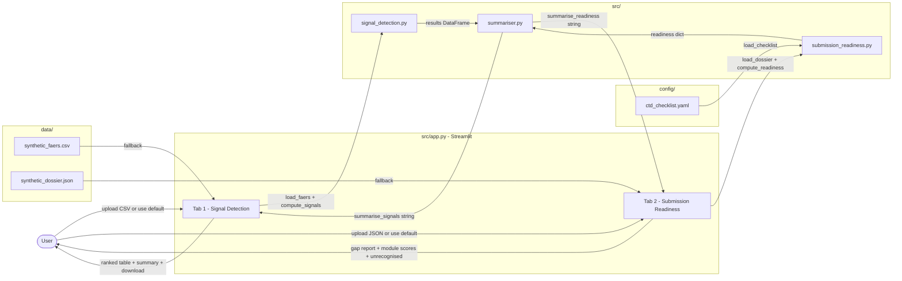

# Architecture — Drug Safety Signal Detector & Regulatory Submission Readiness Checker

## System Overview

This application is a single Streamlit tool that addresses two distinct
pharmacovigilance problems in one interface. Mode 1 applies statistical
disproportionality analysis (PRR + chi-squared) to adverse event reports to
surface drug safety signals before they cause harm. Mode 2 uses fuzzy string
matching to compare a submitted CTD dossier outline against the ICH M4 required
structure and identifies gaps that would cause regulatory rejection. Both modes
are self-contained, run entirely offline, and produce plain-English summaries
from computed results — no external API calls or ML models are involved.

---

## Module Responsibilities

| File | Role |
|---|---|
| `src/app.py` | Streamlit entry point. Two-tab UI: file upload, run buttons, metric cards, tables, progress bars, summary display. Pure glue code — no business logic. |
| `src/signal_detection.py` | Mode 1 core logic. `load_faers` validates and normalises input. `compute_signals` builds the 2×2 contingency table for every drug-event pair, computes PRR and chi-squared, applies flagging thresholds, returns a ranked DataFrame. No Streamlit dependency. |
| `src/submission_readiness.py` | Mode 2 core logic. `load_checklist` parses the YAML. `load_dossier` reads the submitted outline. `match_sections` performs fuzzy matching. `compute_readiness` aggregates per-module completeness scores and gap lists. No Streamlit dependency. |
| `src/summariser.py` | Rule-based NL summary generators. `summarise_signals` and `summarise_readiness` produce plain-English paragraph strings from computed results. Called by `app.py` and displayed in `st.info` boxes. |
| `config/ctd_checklist.yaml` | Single source of truth for the ICH M4 CTD required structure. 5 modules, 57 sections, each with a `risk_note`. Consumed by `submission_readiness.py`. |
| `data/synthetic_faers.csv` | 200-row synthetic adverse event dataset. Embeds deliberate high-PRR signals including one PRR = Inf pair. Default fallback for Mode 1. |
| `data/synthetic_dossier.json` | Synthetic CTD dossier outline covering ~74% of required sections, with deliberate misspellings, genuine gaps, and 4 invented sections. Default fallback for Mode 2. |

---

## Data Flow



---

## Key Algorithms

### Proportional Reporting Ratio (PRR)

For each unique `(drug, event)` pair, a 2×2 contingency table is constructed
from the full adverse event database:

```
┌──────────────────────────────┬──────────────────────────────┐
│  a: this event, this drug   │  b: other events, this drug  │
├──────────────────────────────┼──────────────────────────────┤
│  c: this event, other drugs  │  d: other events, other drugs│
└──────────────────────────────┴──────────────────────────────┘
```

**PRR = (a / (a + b)) / (c / (c + d))**

A PRR of 2 means this drug reports the event twice as often, proportionally,
as the rest of the database. Three thresholds must all be met for a signal
flag (Evans et al., 2001 / EMA guidance):

| Threshold | Value | Rationale |
|---|---|---|
| PRR | ≥ 2 | At least double the background reporting rate |
| Case count (a) | ≥ 3 | Minimum evidence base; single reports are coincidental |
| Chi-squared | ≥ 4 | Statistical significance at approximately p < 0.05 (1 d.f.) |

**PRR = Inf special case:** when `(c + d) = 0`, the reaction has never been
reported for any other drug. This "event exclusivity" is the strongest possible
signal. Chi-squared is undefined on the degenerate table, so it is waived. The
case count guard (≥ 3) is retained. These rows sort to the top of the results
table and are displayed with `PRR = Inf ∞`.

The chi-squared statistic is computed using `scipy.stats.chi2_contingency` with
Yates' correction disabled, consistent with the Evans (2001) definition.

### Fuzzy Section Matching

Submitted dossier section names are matched to required ICH M4 sections using
`rapidfuzz.process.extractOne` with the WRatio scorer. WRatio is a weighted
combination of simple ratio, partial ratio, and token-sort ratio — it handles
minor misspellings, dropped words, and word-order variation well.

A match is accepted when the similarity score is ≥ **80** (the `FUZZY_THRESHOLD`
named constant in `submission_readiness.py`). This value was validated against
the synthetic dossier, which contains deliberate misspellings such as
`"Infomation About the Experts"` (matches `"Information About the Experts"` at
score ≈ 94) and `"Safety Pharmacology"` (matches `"Pharmacology – Safety
Pharmacology"` at score ≈ 86).

Submitted sections that are not claimed by any required section are reported
separately as **unrecognised sections** — useful for identifying supplementary
documents or incorrectly titled required sections.

---

## Extending the App

### Swapping in Live FAERS Data

Replace `data/synthetic_faers.csv` with a real export from the FDA FAERS Public
Dashboard or the openFDA API (`https://api.fda.gov/drug/event.json`). The
required columns are `report_id`, `drug_name`, and `reaction`; all other columns
are optional. The `load_faers` function validates and normalises the input, so no
other code changes are needed.

For large datasets (millions of rows), consider replacing the row-by-row loop in
`compute_signals` with a fully vectorised pandas implementation using
`DataFrame.merge` to compute contingency counts — the current implementation is
correct and clear for demo scale but will slow at FAERS full-database scale.

### Swapping in a Real Dossier Parser

Replace `data/synthetic_dossier.json` with a JSON export generated by a
document parser (e.g. a PDF table-of-contents extractor). The input format is
deliberately simple: a JSON object with a single `"sections"` key containing a
list of strings. Any pipeline that produces that structure works without code
changes.

### Adjusting the Fuzzy Threshold

Edit the `FUZZY_THRESHOLD` constant at the top of `src/submission_readiness.py`.
A value of 85 is stricter (fewer false positives in matching), while 70 is
looser (accepts more approximate titles). The Streamlit UI could also expose
this as a sidebar slider for interactive tuning.

### Adding an LLM Summary Layer

The `summariser.py` functions return plain strings. To upgrade to an LLM-powered
narrative, replace or wrap these functions with a call to any chat completion
API (e.g. `watsonx.ai`, OpenAI, Anthropic). The structured `results_df` and
`readiness` dict provide all the grounding context needed for a faithful,
hallucination-resistant prompt.
