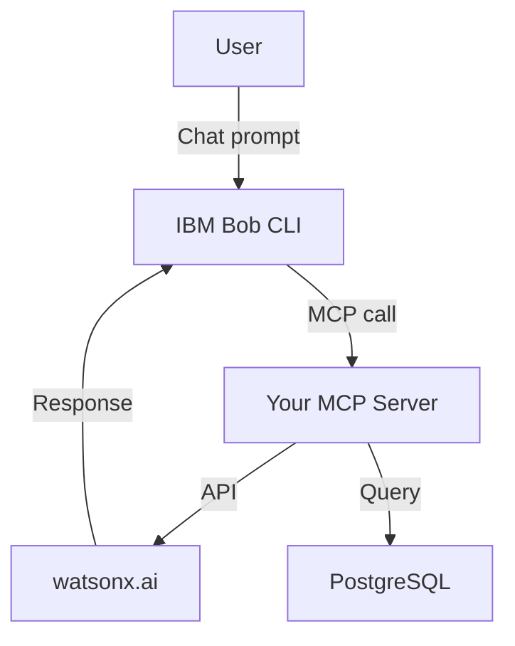

# Bob AI Innovation Hackathon Submission Template — Complete Guide

This guide explains how to use the
[bob-ai-hackathon-submission-template](https://github.com/drijesh-ppatel/bob-ai-hackathon-submission-template)
to structure and submit your hackathon entry.

---

## Table of Contents

1. [Overview](#1-overview)
2. [Getting Started — Use the Template](#2-getting-started--use-the-template)
3. [Repository Structure](#3-repository-structure)
4. [File-by-File Walkthrough](#4-file-by-file-walkthrough)
   - [submission.yaml](#41-submissionyaml--most-important)
   - [README.md](#42-readmemd)
   - [docs/](#43-docs)
   - [src/](#44-src)
   - [demo/](#45-demo)
   - [presentation/](#46-presentation)
5. [Automated Validation](#5-automated-validation)
6. [Submission Checklist](#6-submission-checklist)
7. [How Your Entry Is Evaluated](#7-how-your-entry-is-evaluated)
8. [Common Mistakes](#8-common-mistakes)
9. [FAQ](#9-faq)

---

## 1. Overview

The template gives every team a consistent, well-structured repository so that:

- Judges can find what they need without hunting through your repo
- The automated validation GitHub Action can check your submission is complete
- Your entry is evaluated fairly against the same rubric as every other team

**One template → one repo per team. Do not share repos across teams.**

---

## 2. Getting Started — Use the Template

### Step 1 — Create your repo from the template

1. Go to **[github.com/drijesh-ppatel/bob-ai-hackathon-submission-template](https://github.com/drijesh-ppatel/bob-ai-hackathon-submission-template)**
2. Click the green **"Use this template"** button → **"Create a new repository"**

   > ⚠️ Use **"Use this template"**, not "Fork". A fork shows as derived from the
   > template in GitHub's UI and carries unnecessary history. The template button
   > gives you a clean, independent repo.

3. Name your repo: **`bob-ai-hackathon-[your-team-name]`**
   (e.g., `bob-ai-hackathon-orion-squad`, `bob-ai-hackathon-team-phoenix`)
4. Set visibility to **Public** — judges need to access it
5. Click **"Create repository"**

### Step 2 — Clone your new repo locally

```bash
git clone https://github.com/[your-github-username]/bob-ai-hackathon-[your-team-name].git
cd bob-ai-hackathon-[your-team-name]
```

### Step 3 — Fill in your content (see section 4 below)

### Step 4 — Push and verify the GitHub Action passes

```bash
git add .
git commit -m "feat: initial submission"
git push
```

Then go to your repo → **Actions** tab → confirm **✅ Validate Submission** is green.

### Step 5 — Submit your repo URL via the entry form

---

## 3. Repository Structure

```
bob-ai-hackathon-[your-team-name]/
│
├── submission.yaml          ← Structured metadata — READ BY EVALUATORS FIRST
├── README.md                ← Project overview — human-readable entry point
│
├── src/                     ← All your source code goes here
│   ├── .env.example         ← Template for environment variables
│   └── README.md            ← Brief note on src/ layout
│
├── docs/                    ← Written documentation
│   ├── problem-statement.md ← What problem you're solving and why it matters
│   ├── solution-overview.md ← How your solution works
│   ├── architecture.md      ← Technical architecture (diagram + explanation)
│   └── setup-guide.md       ← Exact steps to run the project
│
├── demo/                    ← Demo artifacts
│   ├── demo-video-link.txt  ← URL to your demo video (YouTube, Loom, Box)
│   ├── live-demo-url.txt    ← URL to your deployed demo (or "NOT DEPLOYED")
│   └── screenshots/         ← App screenshots (at least 3)
│       └── README.md
│
├── presentation/            ← Slide deck (slides.pdf or slides.pptx)
│
├── CONTRIBUTING.md          ← Submission instructions (do not delete)
├── .gitignore               ← Pre-configured — do not commit .env or node_modules
└── .github/
    └── workflows/
        └── validate.yml     ← Automated submission validator (do not modify)
```

---

## 4. File-by-File Walkthrough

### 4.1 `submission.yaml` — Most Important

This is the **first file the evaluators read**. Fill it in carefully and completely.

```yaml
team:
  name: "Orion Squad"                   # Your team name
  track: "AI"                           # AI | DevOps | Sustainability | Open
  lead:
    name: "Alice Chen"
    email: "alice.chen@ibm.com"
  members:
    - name: "Bob Singh"
      email: "bob.singh@ibm.com"
    - name: "Carol Yu"
      email: "carol.yu@ibm.com"

submission:
  title: "SmartOps Dashboard"
  problem_statement: >
    DevOps teams at IBM spend 3+ hours per incident manually correlating
    logs across 12 tools. This delays MTTR and causes alert fatigue for
    on-call engineers.
  solution_summary: >
    SmartOps ingests logs from all observability tools via a unified
    MCP connector and uses watsonx.ai to surface the root cause and
    recommended fix in a single conversational interface.
  key_features:
    - "Unified log ingestion from Instana, PagerDuty, and GitHub Actions"
    - "Root cause classification using watsonx.ai Granite 3.0"
    - "Natural language incident summaries via IBM Bob integration"
    - "One-click runbook execution"
```

**Rules:**
- Every field marked `# REQUIRED` must be filled — blank strings will fail validation
- Do not rename this file

---

### 4.2 `README.md`

The README is the **human-readable front page** of your repo. Replace every
`[placeholder in brackets]` with your actual content.

Key sections to fill:

| Section | What to write |
|---|---|
| **Team** | Team name, track, lead, members |
| **Problem Statement** | 2–3 sentences: what problem, who experiences it |
| **Solution** | 2–3 sentences: what you built, how it works |
| **Key Features** | 3–5 specific implemented features |
| **Tech Stack** | Languages, frameworks, IBM technologies used |
| **How to Run** | Copy the exact commands from `docs/setup-guide.md` |
| **Demo** | Links to video, live demo, screenshots |
| **Known Limitations** | Honest gaps — judges appreciate transparency |
| **What We're Most Proud Of** | Direct judges to your strongest work |

> ✅ Before submitting, search the README for `[` — any remaining brackets mean
> you missed a placeholder.

---

### 4.3 `docs/`

Four files, each with a specific purpose:

#### `docs/problem-statement.md`
Go deeper than the README. Cover:
- The specific audience affected
- Why existing solutions don't solve it
- Quantified pain if you have data (time lost, error rate, cost)
- Why this problem matters *now*

#### `docs/solution-overview.md`
Explain how your solution works at a conceptual level:
- The core mechanism (not just a feature list)
- What makes it different from naive alternatives
- Key design decisions and why you made them
- What the user experience looks like

#### `docs/architecture.md`
Include:
- A **Mermaid diagram** or image showing system components and data flow
- A component table (technology, responsibility)
- How data moves through the system end-to-end
- Any relevant security or scalability notes

Example diagram (replace with your own):


#### `docs/setup-guide.md`
This is the **most critical doc for judges**. Write it as if the reader has
never seen your repo. Include:

- All prerequisites (tools, accounts, versions)
- Every environment variable (copy from `.env.example`)
- Exact install commands
- Exact run commands
- How to verify it's working
- A troubleshooting table for common errors

> ✅ Test your own setup guide on a clean machine or fresh terminal before submitting.

---

### 4.4 `src/`

Put **all source code** inside this directory.

```
src/
├── .env.example        ← List every environment variable with a description
├── README.md           ← Brief description of what's in src/ and how it's organised
├── [your code here]
```

**Rules:**
- `.env` is in `.gitignore` — never commit real credentials
- Update `.env.example` with every variable your code needs (dummy values are fine)
- Do not commit `node_modules/`, `__pycache__/`, `.venv/`, or build artefacts

---

### 4.5 `demo/`

Judges evaluate whether your project **actually works**. The demo folder is
your evidence.

#### `demo/demo-video-link.txt`
Replace the placeholder with a URL to a **3–5 minute video** showing:
1. The app starting up successfully
2. A real user journey through the key feature
3. Actual output being produced (not mocked)

Accepted platforms: YouTube (unlisted), Loom, Box, Google Drive (view-only link)

```
# demo/demo-video-link.txt
https://www.loom.com/share/your-actual-video-id
```

#### `demo/live-demo-url.txt`
If your app is deployed, add the URL here. If not, write `NOT DEPLOYED`.

#### `demo/screenshots/`
Add **at least 3 screenshots** of the running application. Name them sequentially:
```
01-home-dashboard.png
02-query-input.png
03-result-output.png
```

---

### 4.6 `presentation/`

Add your slide deck as `presentation/slides.pdf` (preferred) or `slides.pptx`.

Your deck should cover (in order):
1. Problem — who, what, why it hurts
2. Solution — what you built and how it works
3. Demo / architecture — key technical highlights
4. IBM technology integration — where and how Bob/watsonx is used
5. Impact — what this could become beyond the hackathon

---

## 5. Automated Validation

Every push to your repo triggers the **Validate Submission** GitHub Action
(`.github/workflows/validate.yml`). It checks:

- `submission.yaml` exists and is valid YAML
- Required fields in `submission.yaml` are not empty
- `docs/setup-guide.md` exists
- `demo/demo-video-link.txt` exists

**To check your validation status:**
1. Go to your repo on GitHub
2. Click the **Actions** tab
3. Look for the most recent **Validate Submission** run
4. ✅ green = submission is structurally complete
5. ❌ red = click the run, read the error, fix it, push again

> ⚠️ Do not modify `.github/workflows/validate.yml` — it will be ignored if changed.

---

## 6. Submission Checklist

Work through this before clicking submit:

**Content**
- [ ] `submission.yaml` — all `# REQUIRED` fields filled
- [ ] `README.md` — no `[placeholder]` text remaining
- [ ] `docs/problem-statement.md` — written (not template text)
- [ ] `docs/solution-overview.md` — written (not template text)
- [ ] `docs/architecture.md` — diagram and explanation present
- [ ] `docs/setup-guide.md` — tested end-to-end by a teammate
- [ ] `src/` — all source code committed, `.env.example` updated
- [ ] `demo/demo-video-link.txt` — real working video URL
- [ ] `demo/screenshots/` — at least 3 screenshots of the running app
- [ ] `presentation/slides.pdf` (or `.pptx`) — present

**Technical**
- [ ] No `.env` files committed (check `git log` if unsure)
- [ ] No `node_modules/`, `.venv/`, or build artefacts committed
- [ ] GitHub Actions **✅ Validate Submission** is green
- [ ] Repository is **Public**

**Submission**
- [ ] Entry form submitted before the deadline
- [ ] Repo URL is correct in the form

---

## 7. How Your Entry Is Evaluated

Entries are scored on 6 criteria totalling **100 points**:

| # | Criterion | Pts | What evaluators look for |
|---|---|---|---|
| 1 | Technical Implementation Quality | 25 | Was it actually built, and built well? Reads source code, not just the README |
| 2 | Innovation & Differentiation | 25 | Does it solve the problem in a non-obvious way? Anchored in the code |
| 3 | Problem Depth & Vision | 15 | Does the team deeply understand the problem, not just the spec? |
| 4 | Working Demo & Functionality | 15 | Does it actually run? Can a judge reproduce it? |
| 5 | IBM Bob Integration | 10 | Is IBM Bob load-bearing in the solution, not just name-dropped? |
| 6 | Documentation & Reproducibility | 10 | Can someone else understand, run, and build on this? |

**What this means for you:**
- Evaluators **read your source code** — a polished README with empty `src/` will score low
- A working demo matters — partial functionality that runs scores better than complete scaffolding that doesn't
- IBM Bob must be genuinely integrated, not just mentioned in docs
- Honest `known_limitations` are respected — overclaiming hurts your score when the code doesn't match

---

## 8. Common Mistakes

| Mistake | How to avoid it |
|---|---|
| Leaving `[placeholder]` text in README | Search the file for `[` before pushing |
| Committing `.env` with real credentials | Check `.gitignore` includes `.env`; use `git status` |
| `demo-video-link.txt` still has the placeholder URL | Open the file and replace it with your real link |
| Repository set to Private | Judges cannot access private repos — set to Public |
| `src/` is empty or has only boilerplate | Your source code must be in `src/` |
| Setup guide missing key steps | Test it yourself on a fresh terminal before submitting |
| Video link requires special access | Use "anyone with link" permissions on Loom/YouTube/Box |

---

## 9. FAQ

**Q: Can we use our own repo structure inside `src/`?**
Yes — the structure inside `src/` is entirely up to you. The top-level
structure (the directories and files outside `src/`) must stay as-is.

**Q: Our project has a monorepo with frontend and backend. Where does it go?**
Put everything inside `src/`:
```
src/
├── frontend/
├── backend/
└── README.md   ← explain the layout
```

**Q: Can we add extra files or directories?**
Yes, at the top level or inside `src/`. Do not delete or rename any of
the template files — the validation action and evaluators depend on them.

**Q: What if our demo isn't deployed?**
Write `NOT DEPLOYED` in `demo/live-demo-url.txt`. Your demo video is
the primary evidence — make sure it shows the app running locally.

**Q: Can we update our submission after pushing?**
Yes — keep pushing until the deadline. The evaluators use the state of
your repo at the deadline, not the first push.

**Q: The GitHub Action is failing — what do I do?**
Click the failing run in the Actions tab, read the error message, and
fix the issue it describes. The most common causes are:
- Missing or empty required fields in `submission.yaml`
- `submission.yaml` has invalid YAML syntax (check indentation and quotes)

**Q: Do we need to keep `CONTRIBUTING.md`?**
Yes — do not delete it. It is part of the template structure.

---

*For questions about the hackathon, contact the organiser directly.*
